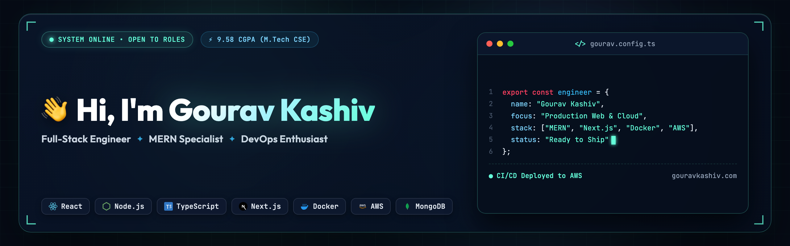

  

  
  
  
  
  

---

### 👨‍💻 Professional Summary
I architect and ship modern web applications end-to-end. My core stack is **MERN** (MongoDB, Express, React, Node.js), and I own the entire deployment pipeline—**CI/CD**, containerization with **Docker**, and **AWS EC2** infrastructure.

- 🔭 **Current Focus**: Rapid prototyping to high-performance, production-ready builds.
- 🌱 **Continuous Learning**: Advanced LLMs, Generative AI, and Scalable Cloud Architectures.
- 🎓 **Education**:
  - **M.Tech in CSE** — Panjab University *(Graduated with Distinction, CGPA: 9.58/10)*
  - **B.E. in CSE** — Chitkara University
- 🏆 **Achievements & Honors**:
  - Quarter-finalist in **Smart India Hackathon** *(IoT-based agricultural monitoring system)*
  - Runners-up in **Octahacks Hackathon**
  - Semi-finalist in **IICDC**

---

### 🛠️ Tech Stack & Skills

  

- **Frontend**: React, Next.js, TypeScript, Tailwind CSS, Framer Motion
- **Backend**: Node.js, Express, REST APIs, Serverless Functions
- **Databases**: MongoDB, PostgreSQL, Supabase
- **DevOps & Cloud**: AWS (EC2, S3), Docker, CI/CD Pipelines, Nginx, Linux
- **AI & Research**: Large Language Models, Generative AI *(Research Published)*

---

### 🚀 Featured Projects
- 🦅 **[Kasauli Coder](https://www.kasaulicoder.com/)** – Digital agency ecosystem & tech community platform featuring high-performance SaaS development, automated content workflows, and hackathon learning tools.
- 🏫 **[St. Bede's ERP System](https://stbedes.campusevo.com/)** – Enterprise institutional management platform engineered for St. Bede's College with centralized records and course workflows deployed on AWS.
- 🏡 **[The Retreat Cottage](https://github.com/gouravkashiv7/the-retreat-cottage)** & **[Operations Manager](https://the-retreat-operations-manager.vercel.app/)** ([GitHub](https://github.com/gouravkashiv7/the-retreat-operations-manager)) – Full-stack hospitality booking platform with real-time availability tracking and multi-property ops manager.
- 🌍 **[GoGlobe](https://go-globe-sepia.vercel.app/)** ([GitHub](https://github.com/gouravkashiv7/goGlobe)) – Interactive travel tracking web application with world map visualization built with React & Context API.
- 🎬 **[StarFlicks](https://star-flicks-one.vercel.app/)** ([GitHub](https://github.com/gouravkashiv7/StarFlicks)) – Modern movie discovery platform with instant search, ratings, and responsive UI.

---

### 📈 GitHub Ecosystem

  

  
  

  

---

  

  

